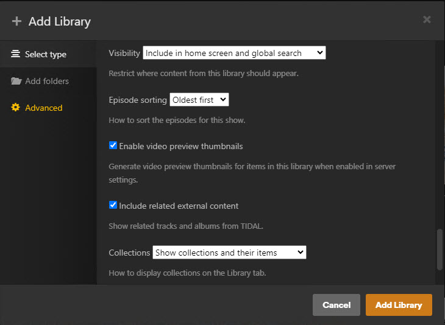
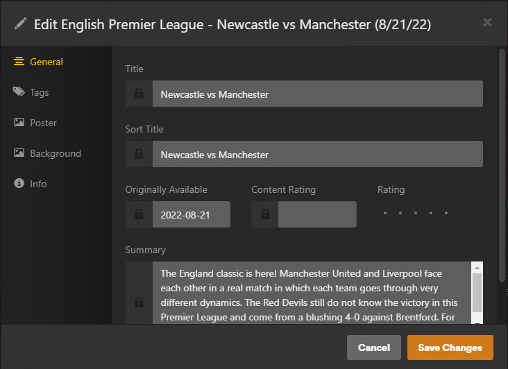

> [!NOTE]
> Support us on Patreon: <a href="https://patreon.com/ProjectKodi">patreon.com/ProjectKodi</a>

# Project Plex - The Sports Database - Plex NFO Importer
## TheSportsDB-NFO.bundle

<ul>
  <li>Can access any Leagues/Seasons/Events/Teams/Players information. Access artwork online or locally.</li>
  <li>Only the appropriate folder structure, NFO files and video files are required. (Example files are available)</li>
    <li>Download: use the following link: <a href="https://github.com/Project-Plex/Project-Plex.github.io/tree/main/Downloads">https://github.com/Project-Plex/Project-Plex.github.io/tree/main/Downloads</a></li>
    <li>Download Example Files: <a href="https://github.com/Project-Plex/Project-Plex.github.io/tree/main/Downloads">TheSportsDB-NFO_Demo_Files-0.9.1.zip</a></li>
    <li>There will later be separate league packages available for download on thesportsdb.com.</li>
    <li>Exchange NFO package in Discord channel, use the scraper from Project Kodi - <a href="https://github.com/Project-Kodi">The Sports Database Pyhton</a> to generate NFO files</li>
    <li>Download Windows Bat file that captures series folders and files. Just put it in the series folder and click! I urgently need examples of working Plex and Kodi libraries. Please help me, you can send me the output file in <a href="https://discord.gg/pFvgaXV">Discord</a>: <a href="https://github.com/Project-Plex/Project-Plex.github.io/tree/main/Downloads">get_full_list.zip</a></li>
  </ul>
  

Github Source: <a href="https://github.com/Project-Plex/TheSportsDB-NFO.bundle">https://github.com/Project-Plex/TheSportsDB-NFO.bundle</a>
  
 Join us at Discord: <a href="https://discord.com/channels/481047912286257152/481047912286257155">TheDataDB</a>

# Documentation

- Download and installation

- Settings

- Display in Plex

- Example files

- NFO & Video file informations

## Download and Installation

### Download & Installation

1. Download the [TheSportsDB-NFO.bundle.zip](https://github.com/Project-Plex/Project-Plex.github.io/tree/main/Downloads) from github,
2. extract it,
3. rename it to **TheSportsDB-NFO.bundle**,
4. find the [Plex Media Server data directory](https://support.plex.tv/hc/en-us/articles/202915258-Where-is-the-Plex-Media-Server-data-directory-located)
5. move the .bundle folder to the Plug-ins directory,
6. restart plex and test,
7. if necessary change the owner and permissions of the .bundle and
8. restart plex again.

### Download & Installation on ubuntu

1. Download from github and unzip
2. Remove "-master" from the end of both folder names.
3. Copy them to the folder:  /var/lib/plexmediaserver/Library/Application Support/Plex Media Server/Plug-ins
4. Find the group number for user "plex" by command "id plex".
5. "cd" to folder in step 3 and change ownership of both folder bundles: "sudo chown plex:{gid} XBMC*"
6. run "sudo service plexmediaserver restart".

## Addon Settings

### Addon Settings - General 

## Display in Plex

### Display in Plex - Plex Default Skin

## Example files

## Example files - for Plex NFO Importer

### Overview Github files

## NFO & Video file informations

## Information about this Project:

 NFO file Importer Agent for Plex, that uses www.thesportsdb.com

 Project Plex: <a href="https://github.com/Project-Plex/">https://github.com/Project-Plex/</a> | Project Kodi: <a href="https://github.com/Project-Kodi/">https://github.com/Project-Kodi/</a>