> [!NOTE]
> Support us on Patreon: <a href="https://patreon.com/ProjectKodi">patreon.com/ProjectKodi</a>

# Project Plex - The Sports Database - Plex NFO Importer
## TheSportsDB-NFO.bundle

<ul>
  <li>Can access any Leagues/Seasons/Events/Teams/Players information. Access artwork online or locally.</li>
  <li>Only the appropriate folder structure, NFO files and video files are required. (Example files are available)</li>
  <li>Use our NFO Export tool: <a href="https://tsdb.sem-one.de/">https://tsdb.sem-one.de/</a> (Folder structure for sports series including NFO files in a zip package)</li>
    <li>Download: use the following link: <a href="https://github.com/Project-Plex/Project-Plex.github.io/tree/main/Downloads">TheSportsDB-NFO.bundle-0.9.1.zip</a></li>
    <li>Download Example Files: <a href="https://github.com/Project-Plex/Project-Plex.github.io/tree/main/Downloads">TheSportsDB-NFO_Demo_Files-0.9.1.zip</a></li>
    <li>There will later be separate league packages available for download on thesportsdb.com.</li>
    <li>Exchange NFO package in Discord channel, use the scraper from Project Kodi - <a href="https://github.com/Project-Kodi">The Sports Database Pyhton</a> to generate NFO files</li>
    <li>Download Windows Bat file that captures series folders and files. Just put it in the series folder and click! I urgently need examples of working Plex and Kodi libraries. Please help me, you can send me the output file in <a href="https://discord.gg/pFvgaXV">Discord</a>: <a href="https://github.com/Project-Plex/Project-Plex.github.io/tree/main/Downloads">get_full_list.zip</a></li>
  </ul>
  

Github Source: <a href="https://github.com/Project-Plex/TheSportsDB-NFO.bundle">https://github.com/Project-Plex/TheSportsDB-NFO.bundle</a>
  
 Join us at Discord: <a href="https://discord.com/channels/481047912286257152/481047912286257155">TheDataDB</a>

# Documentation

- Download and installation
- Settings
- Display in Plex
- Example files
- NFO & Video file informations (An important section after the first test run with the demo files.)
- Information about this Project 

## Download and Installation

### Download & Installation

1. Download the [TheSportsDB-NFO.bundle.zip](https://github.com/Project-Plex/Project-Plex.github.io/tree/main/Downloads) from github,
2. extract it,
3. rename it to **TheSportsDB-NFO.bundle**,
4. find the [Plex Media Server data directory](https://support.plex.tv/hc/en-us/articles/202915258-Where-is-the-Plex-Media-Server-data-directory-located)
5. move the .bundle folder to the Plug-ins directory,
6. restart plex and test,
7. if necessary change the owner and permissions of the .bundle and
8. restart plex again.

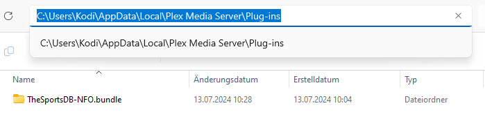

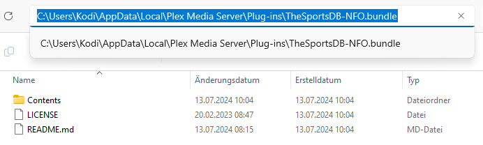

### Download & Installation on ubuntu

1. Download from github and unzip
2. Remove "-master" from the end of both folder names.
3. Copy them to the folder:  /var/lib/plexmediaserver/Library/Application Support/Plex Media Server/Plug-ins
4. Find the group number for user "plex" by command "id plex".
5. "cd" to folder in step 3 and change ownership of both folder bundles: "sudo chown plex:{gid} XBMC*"
6. run "sudo service plexmediaserver restart".

## Settings

### Settings - Plex server 

- Server -> Settings -> Agents

  - **Shows -> TheSportsDB-NFO**: Local Media Assets (TV) -> Position 1, if not enabled, turn it on!
  - **Shows -> TheSportsDB-NFO**: TheSportsDB-NFO -> Position 2, if not enabled, turn it on!

  => Move with drag and drop to reach the desired position
  
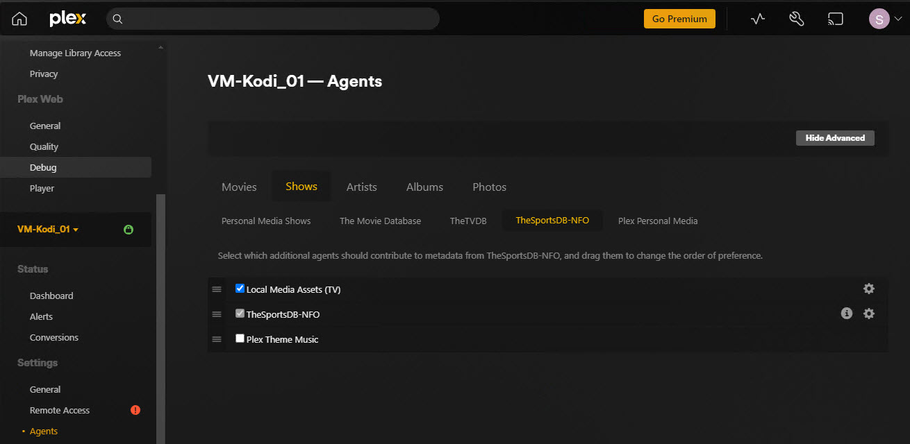

### Settings - Create library 

- Add Library -> Select type

  - **Type**: TV Shows

  - **Name**: Video Library Names, as example: `Sports`

  - **Language**: English - Desired language, currently depending on the contents of the NFO file. 

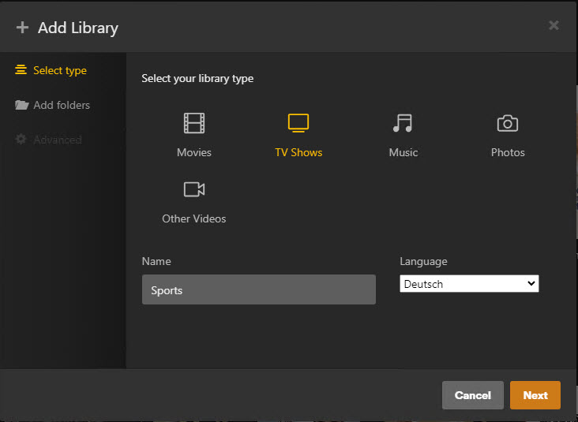

- Add Library -> Add folders

  - **Path**: In our example, the video and NFO files are located under the following path: C:\Plex-Demo-Files\Sports

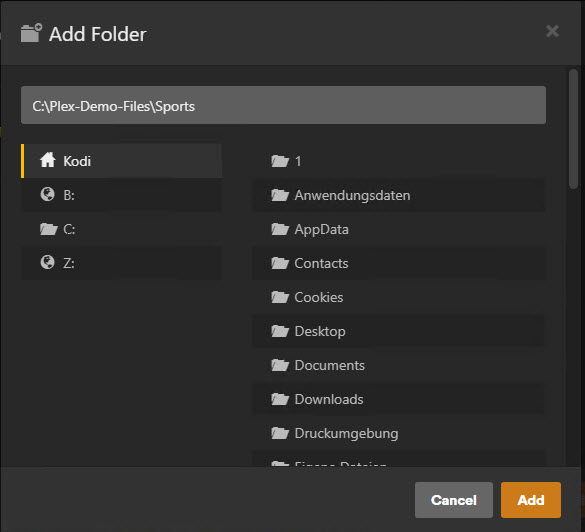

- Add Library -> Advanced

  - **Agent**: Select agent `TheSportsDB-NFO`

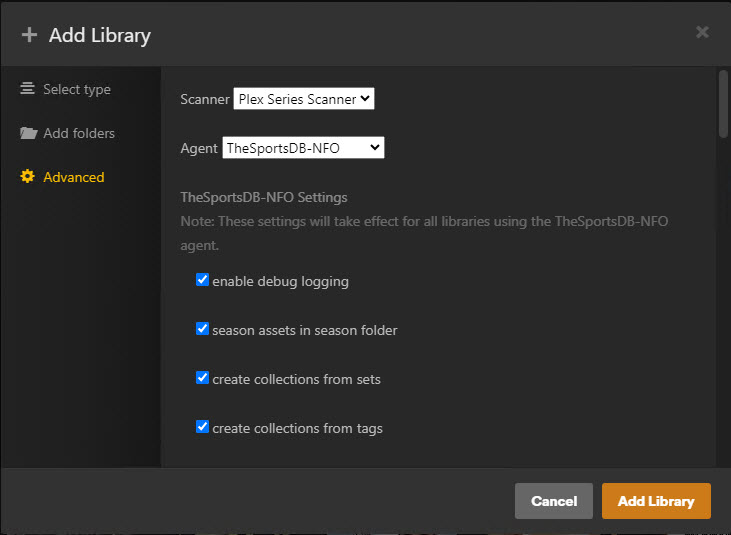

  - **use artwork from the local series folder, else from nfo file**: if switched on then use artwork location 'local' else 'link'

  - **artwork location**: Select agent `link` or `local` | link = get pictures from NFO file over internet, local = use artwork from filesystem

> [!NOTE]
> If you don't have any images in your video collection, the default settings will work.

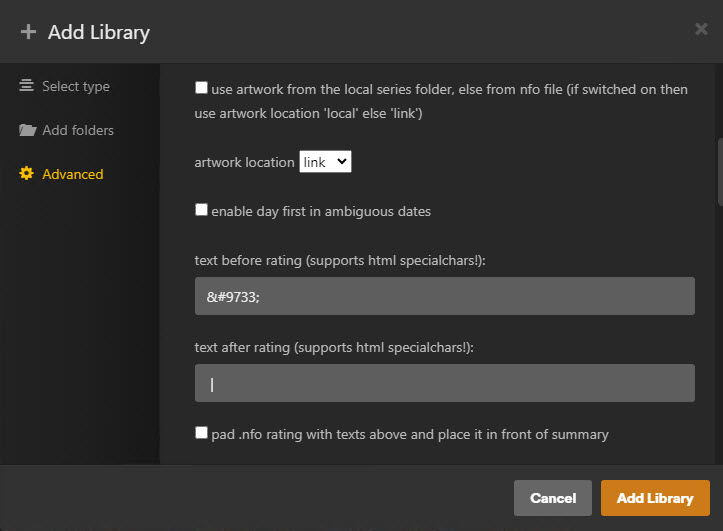

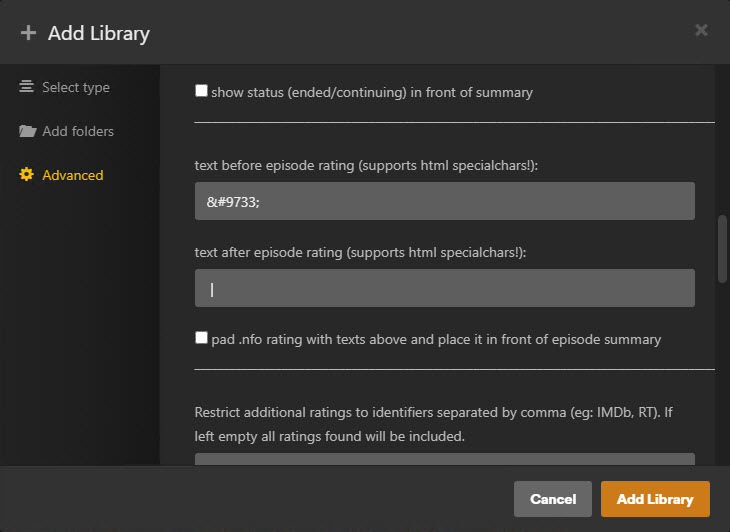

  - **actor thumb location**: Select `link` or `local` | link = get pictures from NFO file over internet, local = use artwork from filesystem

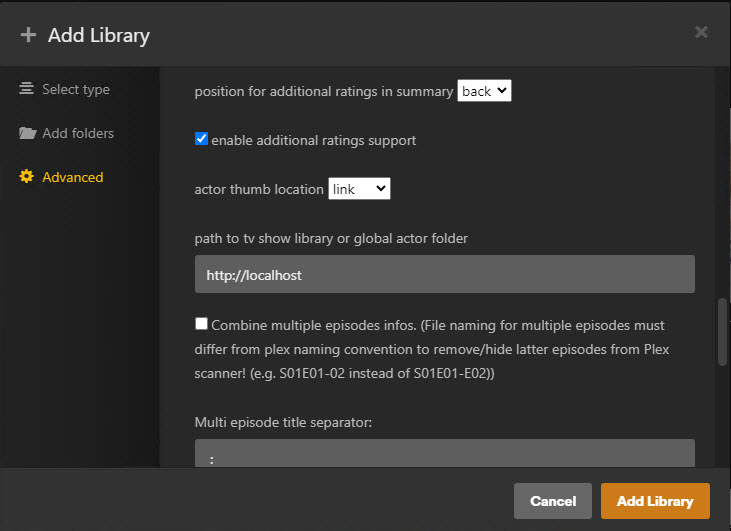

## Display in Plex

### Display in Plex - Plex Default Skin

  - **Overview TV shows**: 

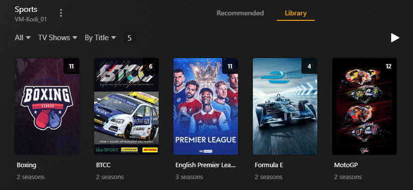

  - **View TV show**: 

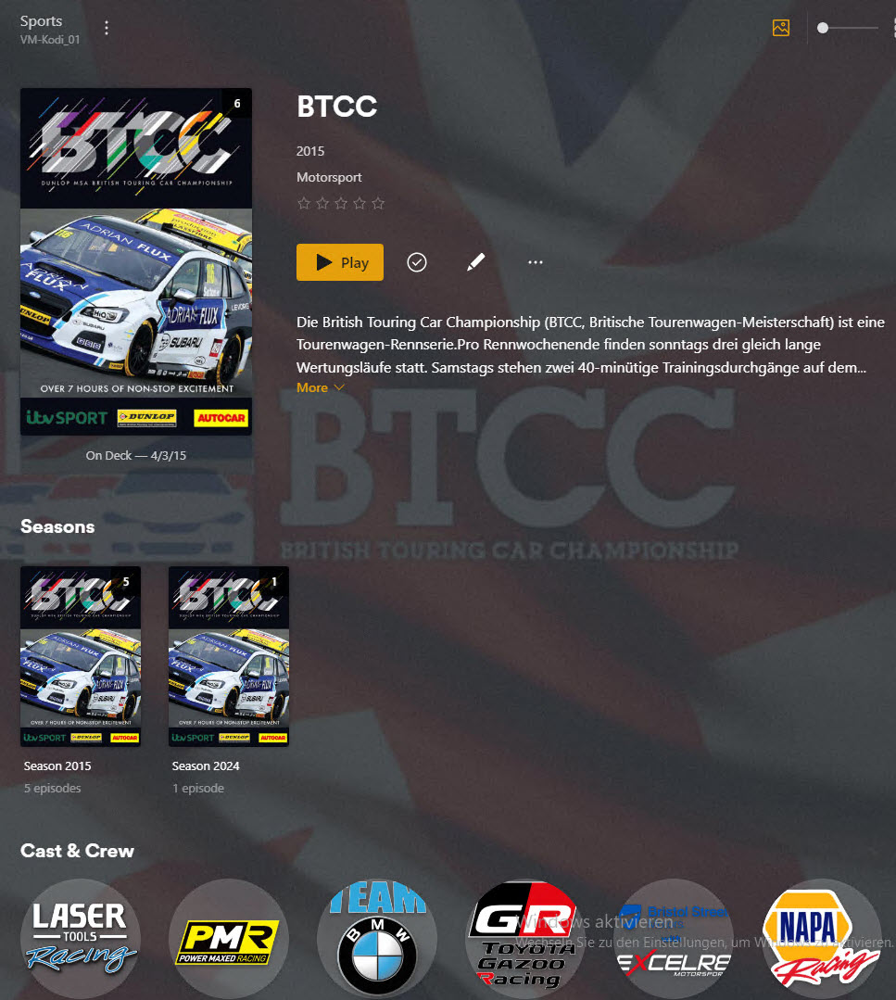

  - **View Season**: 

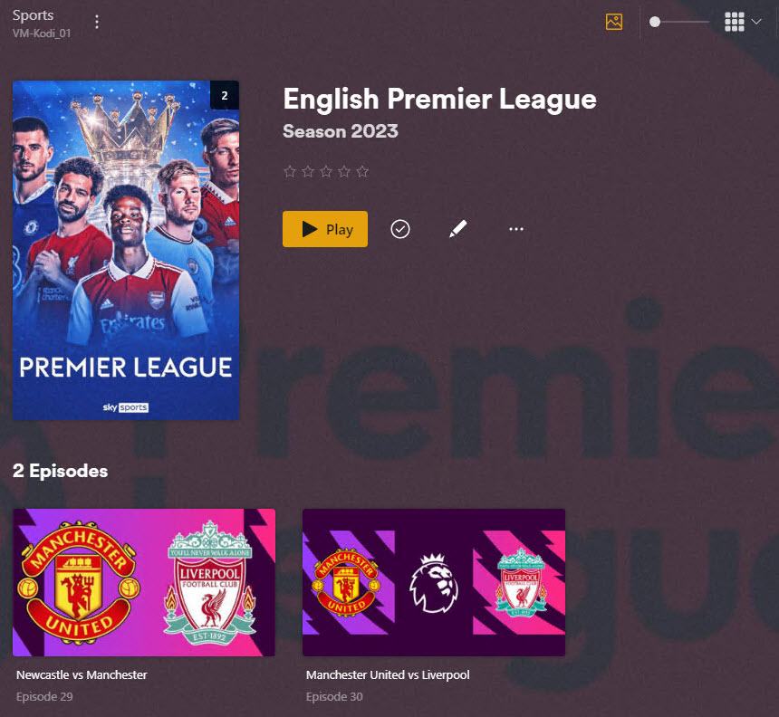

  - **View Episode**: 

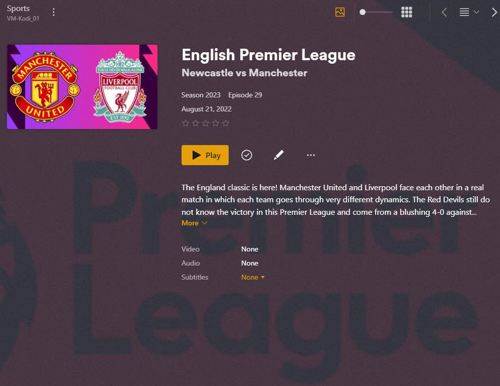

  - **View Episode editor**: 

## Example files

### Example files - for Plex NFO Importer

  - **Sports folder**: League/TV show folders

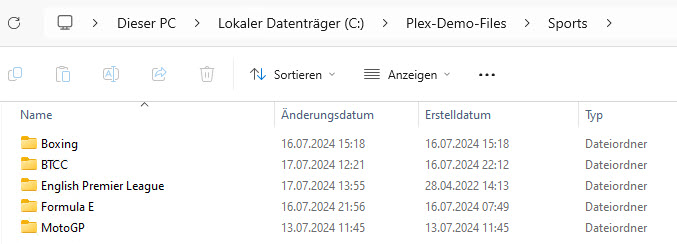

  - **League/TV show folder from**:  `English Premiere League`

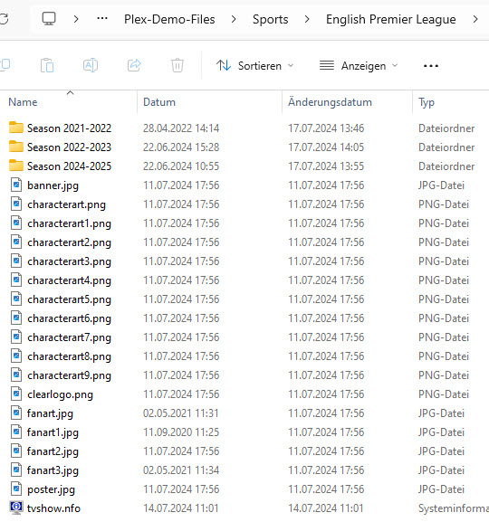

  - **Season folder from**:  `English Premiere League` Season `2021-2022`

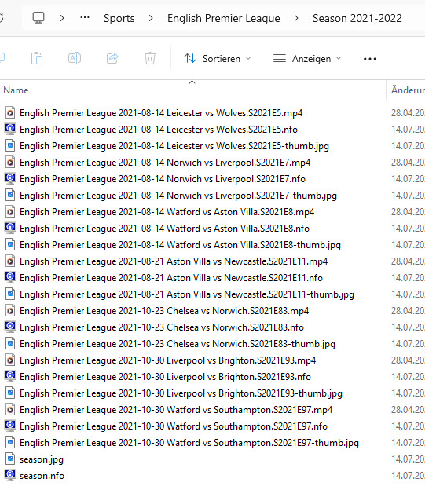

  - **Download link**: <a href="https://github.com/Project-Plex/Project-Plex.github.io/tree/main/Downloads">TheSportsDB-NFO_Demo_Files-0.9.1.zip</a>

### Overview Github files

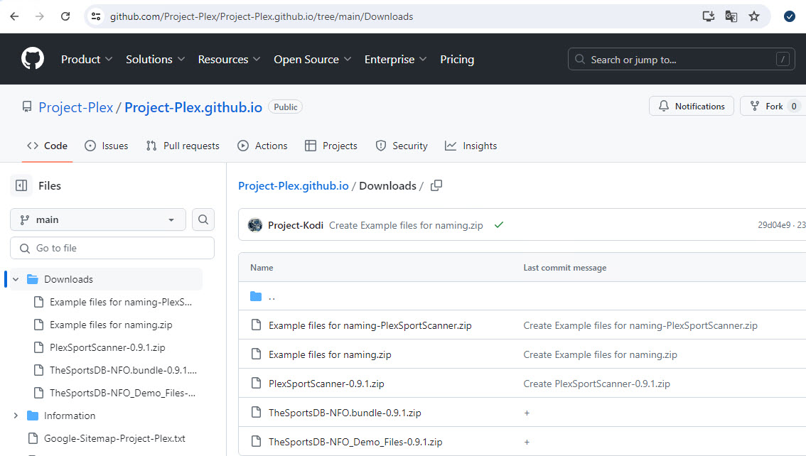

## NFO & Video file informations

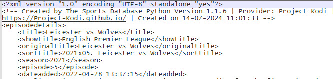

- The following information must be present in the NFO file.

  - **<season>**: The correct season number, no letters or hyphens

  - **<episode>**: The correct episode number, no letters or hyphens

- The following information are important for file naming.

  - **NFO File**: The NFO file must have the same name as the episode video file
  - **Video File**: Must contain the correct season and episode number

Example 1: Formula 1 => Season 2024: https://www.thesportsdb.com/season/4370-Formula-1/2024 / Episode: https://www.thesportsdb.com/event/1963748-Australian-Grand-Prix-Practice-1

  - **<season>**: 2024

  - **<episode>**: Formula 1 2024-03-22 Australian Grand Prix Practice 1.`S2024E14`.mkv

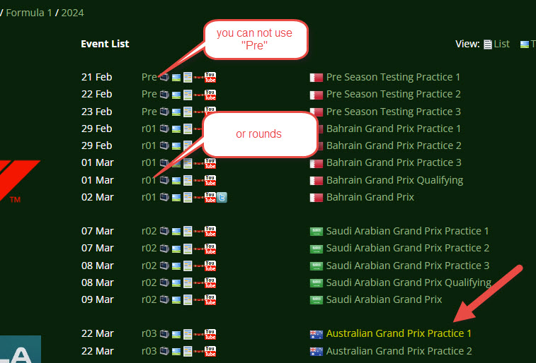

> [!NOTE]
> Some leagues use the rounds multiple times and are therefore not usable. The episode number can only be determined by counting in this examle, or use ready to use NFO files with folders from thesportsdb.com.

Example 2: Formula E => Season 2021-2022: https://www.thesportsdb.com/season/4371-Formula-E/2021-2022 / Episode: https://www.thesportsdb.com/event/1392214-Monaco-E-Prix

  - **<season>**: 2022 => Do not use 2021-2022 or 2021, only 2022! Always the higher. In Filesystem, you can use /Season 2021-2022/ as folders.

  - **<episode>**: Formula E 2022-04-30 Monaco E Prix.`S2022E6`.mkv not Formula E 2022-04-30 Monaco E Prix.`S2021-2022E6`.mkv (Always the higher)

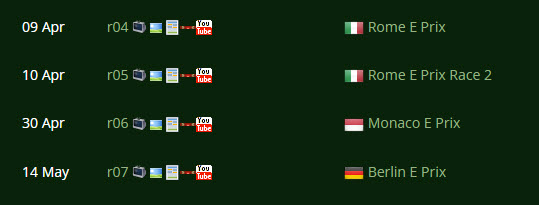

> [!NOTE]
> Here we can take the rounds as episodes, but we have to be careful when naming the seasons!

## Information about this Project:

 NFO file Importer Agent for Plex, that uses www.thesportsdb.com

 The TheSportsDB.com Forum: <a href="https://www.thesportsdb.com/forum_topic.php?t=5972" target="_blank">[Plex Add-on] Plex NFO Importer</a>

 Project Plex: <a href="https://github.com/Project-Plex/">https://github.com/Project-Plex/</a> | Project Kodi: <a href="https://github.com/Project-Kodi/">https://github.com/Project-Kodi/</a>